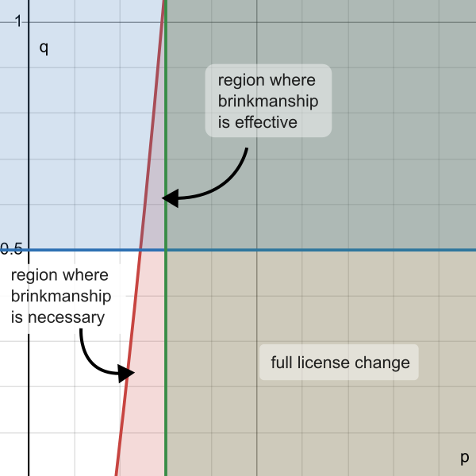

# The Game Theory

Let's formalize some of [the story](/).

## Interests of parties

**Elastic:**

1. Get Amazon to cooperate with them as an official partner, sharing revenue
2. Make money by getting more users on their Elastic Cloud
3. Commit to supporting open-source software (see Elastic's blog posts, ["Doubling down on open"](https://www.elastic.co/blog/licensing-change) and ["Doubling down on open, part II"](https://www.elastic.co/blog/licensing-change))

**Amazon:**

1. Make money by increasing usage of their cloud platform by exploiting the popularity of Elasticsearch

Elastic is the party in this case that enacts brinkmanship. The disaster that both companies wish to avoid is Elastic invoking the license change, Amazon not cooperating, and both companies losing business/reputation: Elastic loses because fewer users would be willing to use Elasticsearch under the new license and they would going back on their commitment to open-source promises, and Amazon loses because they would no longer be able to provide Elasticsearch as a managed service.

## Inherent uncertainty in the situation

Elastic didn't know how Amazon would respond even if they did their licensing change. Though Elastic knew that Amazon would no longer be able to continue offering Elasticsearch as it existed without paying Elastic, they could not be certain whether Amazon would cooperate or not.

## Escalation and giving up of control

By issuing the license change, Elastic would give up some degree of control to the market. Decision-making power was pushed to users, as they could decide whether to stay with Elasticsearch under the more restrictive SSPL license or migrate to a different search platform. The longer Amazon delayed cooperating with Elastic, the greater the potential losses for both companies.

Amazon's decision to cooperate appeared probabilistic from the outside, as Elastic was unsure about Amazon leaders' predispositions towards cooperation. Moreover, unpredictable shifts in the market could affect whether cooperation was profitable or unprofitable.

## Quantitative assessment

Elastic must decide whether to change their license from Apache 2.0 to SSPL. If yes, Amazon has the option to either cooperate with Elastic or not. Payoffs are assigned heuristically:

1. If Elastic doesn't changes their license, they lose out on potential revenue due to Amazon's competing services, while Amazon sustains no net change in revenue.
2. If Elastic changes their license and Amazon cooperates, both companies profit if cooperation is profitable and only Elastic profits if cooperation is unprofitable.
3. If Elastic changes their license and Amazon doesn't cooperate, both companies lose out on profit and Elastic would take an especially hard hit to its reputation for going back on its commitment to open-source.

### When is a pure license change sensible?

To determine the conditions under which a license change is sensible, we do casework on whether cooperating is profitable for Amazon or not. Suppose the probability of cooperation being profitable is $p$. Then:

1. If cooperation is profitable and Elastic changes their license, then Amazon will cooperate for a payout of $(5, 2)$.
2. If cooperation is unprofitable and Elastic changes their license, then Amazon will not cooperate for a payout of $(-5, -1)$.

The expected payout for Elastic changing their license is thus
$$5p + -5(1 - p) = -5 + 10p.$$
This must be greater than the payout for not changing their license ($-2$), meaning we must have

$$
\begin{aligned}
  -5 + 10p &> 2 \\\\
  10p &> 3 \\\\
  p &> 0.3.
\end{aligned}
$$

### Brinkmanship (threat of a license change)

However, because the market is unpredictable, it is possible that an Elasticsearch license change and ensuing Amazon non-cooperation isn't as disastrous as predicted. This would result in the "no change" payoffs. Suppose the probability that Amazon not cooperating results in no change at all is $1 - q$. Then we revise the payoffs as follows:

1. Elastic: $-5q - 2(1-q) = -2 - 3q$
2. Amazon: $-2q + 0(1-q) = -2q$

### Effectiveness condition

The effectiveness condition is the probability of disaster $q$ (i.e. bad payoffs if Amazon doesn't cooperate) required to cause Amazon to cooperate. Note that if cooperation is profitable, Amazon will always cooperate as $2 > -2q$.

If cooperation is unprofitable, $q$ must satisfy
$$-1 > -2q \implies q > 0.5$$
in order for Amazon to cooperate.

### Acceptability condition

The acceptability condition the set of $p, q$ for which the expected payoff to a license change is greater for Elastic than no license change. Suppose Elastic changes their license; then,

1. If cooperation is profitable, Amazon will cooperate for a payoff of $5$.
2. If cooperation is unprofitable and Amazon will not cooperate, payoff is $-2 - 3q$.
3. If Elastic doesn't change their license, payoff is $-2$.

The acceptability condition is therefore

$$
\begin{aligned}
  5p + (-2 - 3q)(1-p) &> -2 \\\\
  5p + (-2 - 3q + 2p + 3pq) &> -2 \\\\
  3pq + 7p - 3q - 2 &> 2 \\\\
  3p(q + 7) &> 4 + 3q \\\\[0.5em]
  p &> \frac{4 + 3q}{3q + 21}.
\end{aligned}
$$

## Graph

